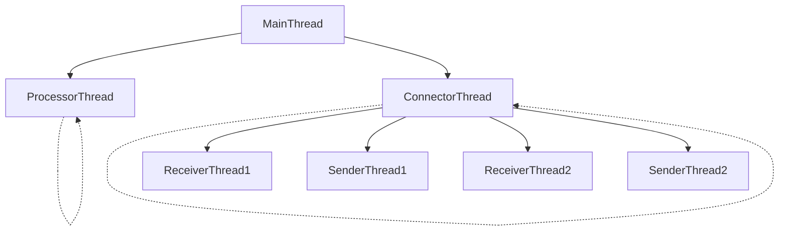

# rustyPrism
This is a set of components written in Rust used to create and simulate a financial market. It creates FIX (Financial Information eXchange) message connectors and processors to perform various tasks along the lifecycle of a trade. The core idea of this project is to utilize a set of processes to simulate each node in the lifecycle of the trade. Each node then generates its own threads to perform concurrent async tasks, such as reading from an input file, creating connection channels or creating a processor thread.

### Thread Architecture of a single node

The `MainThread` generates two async threads which run continuously and concurrently. The `ConnectorThread` is responsible for continuously listing to incoming connections and creating `ReceiverThread` to receive FIX Messages over a TCP socket. 

Each `ReceiverThread` creates a `SenderThread` whose control is held by the `ConnectorThread` in order to manage active TCP connections.



Each message received by the `ReceiverThread` is held on shared queues which is continuously processed by the `ProcessorThread` and then accessed by the `SenderThread` in order to send the processed messages to the next node.


## How to run the project
### Prerequisites
In order to run the project you will need cargo and rust installed on your machine. Use your prefered methods to set up the rust development environment.

### Running the project
To run the project, clone the repository and run the following commands in the root directory of the project:
```bash
source message_gen.sh messages.txt 1000
source message_gen.sh messages2.txt 1000
cargo run
```

This will run the three nodes of the project. The first two commands will generate two files with 1000 messages each. The third command will run the project. The project will read the two files and send the messages to the next node. The messages will be processed and then sent to the next node. The messages will be printed on the console.