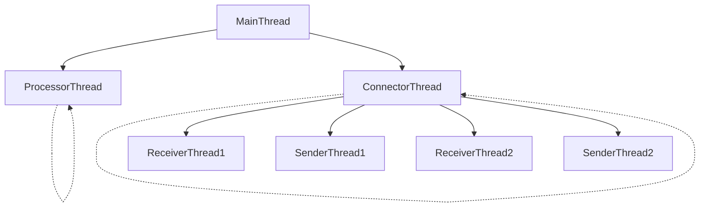

# rustyPrism
This is a set of components written in Rust used to create and simulate a financial market. It creates FIX (Financial Information eXchange) message connectors and processors to perform various tasks along the lifecycle of a trade. The core idea of this project is to utilize a set of processes to simulate each node in the lifecycle of the trade. Each node then generates its own threads to perform concurrent async tasks, such as reading from an input file, creating connection channels or creating a processor thread.

### Thread Architecture of a single node

The `MainThread` generates two async threads which run continuously and concurrently. The `ConnectorThread` is responsible for continuously listing to incoming connections and creating `ReceiverThread` to receive FIX Messages over a TCP socket. 

Each `ReceiverThread` creates a `SenderThread` whose control is held by the `ConnectorThread` in order to manage active TCP connections.

Each message received by the `ReceiverThread` is held on shared queues which is continuously processed by the `ProcessorThread` and then accessed by the `SenderThread` in order to send the processed messages to the next node.
