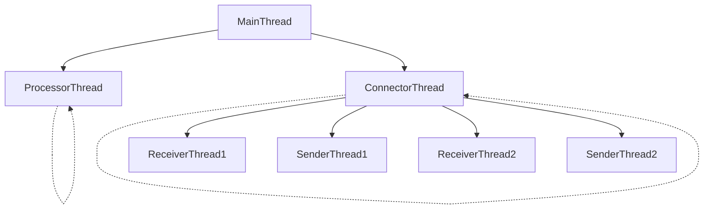

# rustyPrism
This is a set of components written in Rust used to create and simulate a financial market. It creates FIX (Financial Information eXchange) message connectors and processors to perform various tasks along the lifecycle of a trade. The core idea of this project is to utilize a set of processes to simulate each node in the lifecycle of the trade. Each node then generates its own threads to perform concurrent async tasks, such as reading from an input file, creating connection channels or creating a processor thread.

### Thread Architecture of a single node

The `MainThread` generates two async threads which run continuously and concurrently. The `ConnectorThread` is responsible for continuously listing to incoming connections and creating `ReceiverThread` to receive FIX Messages over a TCP socket. 

Each `ReceiverThread` creates a `SenderThread` whose control is held by the `ConnectorThread` in order to manage active TCP connections.



Each message received by the `ReceiverThread` is held on shared queues which is continuously processed by the `ProcessorThread` and then accessed by the `SenderThread` in order to send the processed messages to the next node.


## How to run the project
### Prerequisites
In order to run the project you will need cargo and rust installed on your machine. Use your prefered methods to set up the rust development environment.

### Running the project
To run the project, clone the repository and run the following commands in the root directory of the project:
```bash
source message_gen.sh messages.txt 1000
source message_gen.sh messages2.txt 1000
cargo run
```

This will run the three nodes of the project. The first two commands will generate two files with 1000 messages each. The third command will run the project. The project will read the two files and send the messages to the next node. The messages will be processed and then sent back to the client nodes. The messages will be printed on the console as they are processed.

### Running the tests
To run the tests, run the following command in the root directory of the project:
```bash
cargo test
```

### Running a compiled build
To run a compiled build, run the following command in the root directory of the project:
```bash
cargo build --release
./target/release/rustyPrism
```

## Project Structure
The project is divided into two parts, one for the exchange library and the other for the FIX message connectors, also called interfaces. The exchange library is responsible for creating the FIX messages and processing them. The interfaces are responsible for creating the TCP connections and sending, receiving and processing the messages.

### Exchange Library
This library deals with the maintainence of the orderbook and matching executions. It also converts FIX messages to the Order type understood by the exchange (for now, future design goals tbd).

### Interfaces
The interfaces are responsible for creating the TCP connections and sending, receiving and processing the messages. The interfaces are divided into two parts, the connector and the processor. The connector is responsible for creating the TCP connections and the processor is responsible for processing the messages. There are two types of interfaces in the project, which represent the two types of nodes in the system, the client and the exchange. The client interfaces are responsible for creating the TCP connections to the exchange and sending and receiving messages to and from the exchange. The exchange interfaces are responsible for creating the TCP connections to the clients and sending and receiving messages to and from the clients.

#### Connector
The connector is responsible for creating the TCP connections. It creates a TCP listener and listens for incoming connections. Once a connection is received, it creates a receiver and a sender thread to receive and send messages over the TCP connection.

#### Processor
The processor is responsible for processing the messages. It receives the messages from the connector and processes them. It then sends the processed messages to the sender thread which sends the messages over the TCP connection established by the connector.