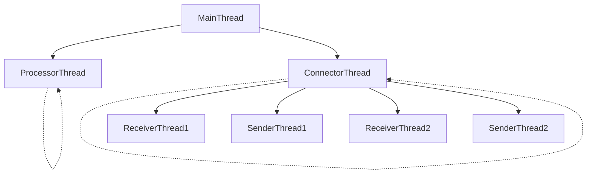
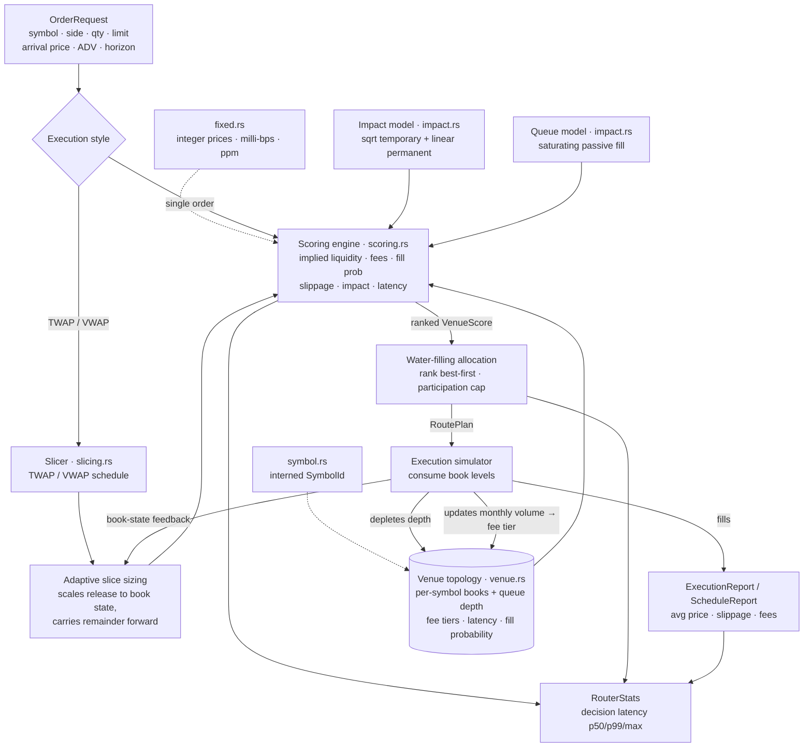
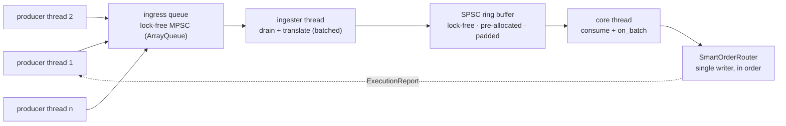

# rustyPrism
This is a set of components written in Rust used to create and simulate a financial market. It creates FIX (Financial Information eXchange) message connectors and processors to perform various tasks along the lifecycle of a trade. The core idea of this project is to utilize a set of processes to simulate each node in the lifecycle of the trade. Each node then generates its own threads to perform concurrent async tasks, such as reading from an input file, creating connection channels or creating a processor thread.

### Thread Architecture of a single node

The `MainThread` generates two async threads which run continuously and concurrently. The `ConnectorThread` is responsible for continuously listing to incoming connections and creating `ReceiverThread` to receive FIX Messages over a TCP socket. 

Each `ReceiverThread` creates a `SenderThread` whose control is held by the `ConnectorThread` in order to manage active TCP connections.


```mermaid
flowchart TD;
    MainThread-->ProcessorThread
    ProcessorThread-.->ProcessorThread
    MainThread-->ConnectorThread
    ConnectorThread-.->ConnectorThread
    ConnectorThread-->ReceiverThread1
    ConnectorThread-->SenderThread1
    ConnectorThread-->ReceiverThread2
    ConnectorThread-->SenderThread2
```

Each message received by the `ReceiverThread` is held on shared queues which is continuously processed by the `ProcessorThread` and then accessed by the `SenderThread` in order to send the processed messages to the next node.

------to be continued------

## Smart Order Router (`src/router`)

The `router` module is a self-contained Smart Order Router prototype that makes
cost-minimising routing decisions across a simulated multi-venue topology. It is
generic over venue data and does not require a live FIX connection, so it can be
unit-tested and benchmarked deterministically.

### Components

| Module | Responsibility |
| --- | --- |
| `router::fixed` | Integer fixed-point arithmetic (`Fixed`, milli-bps, ppm) plus integer sqrt — no floating point on the hot path. |
| `router::symbol` | Symbol interning (`SymbolRegistry` → dense `SymbolId`) so venue lookups never hash strings. |
| `router::venue` | Simulated per-symbol order books, price levels with queue depth, maker/taker **fee tiers**, venue latency and fill probability. |
| `router::impact` | Microstructure model: square-root **temporary market impact**, linear permanent impact, a Poisson **queue-fill** model and latency-driven quote decay. |
| `router::scoring` | Scores every destination for an order using implied liquidity, fees, fill probability, slippage, impact and latency; configurable weights. |
| `router::sor` | Greedy water-filling allocation, execution simulation against the books, adaptive child-slice sizing, and nanosecond decision-latency statistics. |
| `router::slicing` | **TWAP** and **VWAP** slicing schedules with configurable intervals and a U-shaped intraday volume profile. |
| `router::topology` | Deterministic, seeded multi-venue topology generator (no external RNG dependency). |
| `backtest` | Seeded market simulator plus an execution-quality runner (implementation shortfall, vs-VWAP, fill rate, fees). |
| `execution::gateway` | `VenueGateway` trait and a FIX-backed simulated venue (`NewOrderSingle` → `ExecutionReport`). |
| `execution::executor` | `IntegratedRouter` that routes through the SOR, sends child orders over FIX, and feeds venue book state back into the router. |
| `disruptor::ring` | Lock-free, cache-line-padded SPSC ring buffer — the Disruptor ring (pre-allocated, allocation-free hot path). |
| `disruptor::pipeline` | Ingress queue → ingester thread → ring → core handler topology, with a configurable wait strategy. |
| `execution::sor_pipeline` | The SOR hosted on the pipeline: many concurrent submitter threads, one deterministic core thread. |

### Routing logic

1. Every venue is scored for the order. Marketable orders are swept against the
   simulated book to measure slippage, depth coverage and impact; passive orders
   use maker fees and queue-fill probability.
2. Venues are ranked best-first and each receives as much displayed implied
   liquidity as it can support, capped by a fraction of ADV. This greedy sweep is
   a cost-minimising water-filling allocation: marginal cost is non-decreasing as
   the ranking is traversed.
3. When executing a schedule, child slices adapt to current book state: the
   release is scaled toward `min_slice_fraction` when displayed liquidity cannot
   cover the slice, and the remainder is carried forward to a later interval.

All routing decisions record their wall-clock latency via `Instant`; in a release
build a full six-venue scoring + allocation pass completes in well under a
microsecond, and the router tracks avg/min/max decision time.

### Low-latency hot path

The decision path is engineered to avoid the three usual sources of latency and
jitter:

1. **No floating point.** Prices and quantities are [`fixed::Fixed`] integers and
   costs are milli-basis-points. This is deterministic and avoids `f64`
   conversion in the inner loop. The only remaining float use is the seeded
   topology generator (setup time) and test/demo formatting.
2. **No string keys.** `OrderRequest.symbol` is interned once per order into a
   dense `SymbolId`; venue books and per-venue statistics are `Vec`-indexed.
3. **No steady-state allocation.** `score_destinations_into`, `route_into`,
   `execute_into` and `execute_schedule_into` write into caller-owned
   `Vec<VenueScore>`, `RoutePlan`, `ExecutionReport` and `ScheduleReport`
   buffers. Reusing a plan/report removes ~170 ns of allocator work per order
   and, more importantly, the long tail caused by allocator behaviour.

For convenience the allocating wrappers (`score_destinations`, `route`,
`execute`, `execute_schedule`) remain, but the benchmark harness measures both
and shows the reused-buffer variants are consistently faster.

### Architecture


```mermaid
flowchart TD
    REQ["OrderRequest<br/>symbol · side · qty · limit<br/>arrival price · ADV · horizon"]
    STYLE{"Execution style"}
    SLICER["Slicer · slicing.rs<br/>TWAP / VWAP schedule"]
    ADAPT["Adaptive slice sizing<br/>scales release to book state,<br/>carries remainder forward"]
    SCORE["Scoring engine · scoring.rs<br/>implied liquidity · fees · fill prob<br/>slippage · impact · latency"]
    ALLOC["Water-filling allocation<br/>rank best-first · participation cap"]
    EXEC["Execution simulator<br/>consume book levels"]
    REP["ExecutionReport / ScheduleReport<br/>avg price · slippage · fees"]
    STATS["RouterStats<br/>decision latency p50/p99/max"]

    MD[("Venue topology · venue.rs<br/>per-symbol books + queue depth<br/>fee tiers · latency · fill probability")]
    IMP["Impact model · impact.rs<br/>sqrt temporary + linear permanent"]
    QUE["Queue model · impact.rs<br/>saturating passive fill"]
    FX["fixed.rs<br/>integer prices · milli-bps · ppm"]
    SYM["symbol.rs<br/>interned SymbolId"]

    SYM -.-> MD
    FX -.-> SCORE
    REQ --> STYLE
    STYLE -->|"single order"| SCORE
    STYLE -->|"TWAP / VWAP"| SLICER --> ADAPT --> SCORE
    MD --> SCORE
    IMP --> SCORE
    QUE --> SCORE
    SCORE -->|"ranked VenueScore"| ALLOC
    ALLOC -->|"RoutePlan"| EXEC
    EXEC -->|"fills"| REP
    EXEC -->|"depletes depth"| MD
    EXEC -->|"updates monthly volume → fee tier"| MD
    EXEC -->|"book-state feedback"| ADAPT
    SCORE --> STATS
    ALLOC --> STATS
    REP --> STATS
```

### Running the demo

```bash
cargo run --release --example sor_demo
```

This prints the simulated venue topology, per-venue scores, a market-order
execution, and adaptive TWAP and VWAP schedule runs.

### Benchmarking

Two benchmark targets cover the router:

- **`latency_percentiles`** records the full distribution of per-call wall-clock
  latencies and prints exact percentiles (min/p50/p90/p99/p99.9/max). Topology
  construction is excluded from the timed region so only router work is measured.
- **`sor_bench`** is a Criterion suite with warm-up, outlier detection and
  confidence intervals for scoring, routing, execution, scheduling and topology
  construction.

```bash
cargo bench --bench latency_percentiles
cargo bench --bench sor_bench
# Criterion also supports a fast pass:
cargo bench --bench sor_bench -- --quick
```

Example release-mode output from `latency_percentiles` on an Apple Silicon
machine (all values in nanoseconds):

| operation | p50 | p99 | p99.9 |
| --- | ---: | ---: | ---: |
| `score_destinations` (6 venues) | 416 | 459 | 542 |
| `route` market | 459 | 500 | 625 |
| `route` market, reused plan | 375 | 417 | 541 |
| `route` passive limit | 333 | 334 | 458 |
| `execute` market | 625 | 708 | 792 |
| `execute` market, reused report | 459 | 500 | 625 |
| `execute_schedule` TWAP (5 slices) | 3584 | 3750 | 11417 |

The routing decision itself (`score_destinations` + `route`) stays below one
microsecond through p99.9. The five-slice schedule is reported end-to-end because
it executes each child against the mutating books.

The same harness also measures how the decision scales with the number of venues
(cycling the simulated templates):

| venues | p50 | p99 |
| ---: | ---: | ---: |
| 6 | 459 | 500 |
| 12 | 834 | 875 |
| 24 | 1709 | 1833 |
| 48 | 3667 | 3792 |
| 96 | 7250 | 7416 |

Cost grows roughly linearly at ~75 ns per venue on this machine, dominated by
per-venue scoring plus the ranking sort. Even at 96 venues p99 is under 8 µs.

### Backtesting & execution quality

The `backtest` module drives a router through a seeded market simulator and
reports standard execution-quality metrics. It is deterministic for a given
seed, so strategy comparisons are reproducible.

```rust
use rusty_prism::backtest::{run_backtest, BacktestConfig, Strategy};
use rusty_prism::router::slicing::SliceSchedule;

let strategy = Strategy::Schedule(SliceSchedule::twap(Fixed::from_f64(10_000.0), 50, 10));
let result = run_backtest(&mut router, &mut simulator, symbol, &request, &strategy, &config);
println!("{}", result.summary());
```

Metrics per run: implementation shortfall versus arrival, performance versus the
interval VWAP, fill rate, executed quantity, total fees and the number of child
orders. Run the comparison demo with:

```bash
cargo run --release --example backtest_demo
```

### FIX integration

The `execution` module closes the loop the pure router leaves open. Each child
allocation is encoded as a FIX `NewOrderSingle` (MsgType `D`), decoded by the
venue, matched by the existing `Exchange`, and answered with FIX
`ExecutionReport` (MsgType `8`) messages that are encoded and decoded again. The
venue's post-trade book is then pushed back into the router's market-data view.

```bash
cargo run --release --example fix_integration_demo
```

The FIX path is behind the `VenueGateway` trait, so a TCP session can replace the
in-process simulator without changing the router.

### Concurrency pipeline (LMAX Disruptor style)

The router is single-threaded by design — that is what makes its decisions
fast and deterministic. To let many callers feed it concurrently, `src/disruptor`
implements an LMAX-style staged pipeline:


```mermaid
flowchart LR
    P1["producer thread 1"] --> Q
    P2["producer thread 2"] --> Q
    P3["producer thread n"] --> Q
    Q["ingress queue<br/>lock-free MPSC (ArrayQueue)"] --> I["ingester thread<br/>drain + translate (batched)"]
    I --> R["SPSC ring buffer<br/>lock-free · pre-allocated · padded"]
    R --> C["core thread<br/>consume + on_batch"]
    C --> H["SmartOrderRouter<br/>single writer, in order"]
    H -.->|"ExecutionReport"| P1
```

- **Ingress** is a bounded, lock-free multi-producer queue
  ([`crossbeam_queue::ArrayQueue`]). Bursts are absorbed and producers feel
  backpressure instead of growing memory without bound.
- **Ingester** drains ingress in batches, translates raw input into typed
  commands, and publishes them to the ring, preserving arrival order.
- **Ring** is a lock-free SPSC buffer: no locks, no allocation after startup,
  `head`/`tail` padded onto separate cache lines, acquire/release publication.
- **Core** consumes commands in strict order and dispatches them via
  `EventHandler::on_batch`, so business logic stays deterministic even though
  submitters are concurrent.

Both threads **spin rather than park**, removing the scheduler wake-up that
otherwise dominates the round trip. `WaitStrategy` chooses `Yield` (lower CPU)
or `BusySpin` (lowest tail). `pin_threads` assigns the ingester and core to
dedicated cores where the platform supports it (best-effort; see
`available_core_ids`). The topology is generic over command type and handler, so
the exchange side can adopt the same structure with its own `EventHandler`.

#### Direct mode (single producer)

Fan-in pays for concurrency with an extra thread hop (caller → ingester → core).
When a single thread produces — one feed handler, one gateway session — that hop
is pure overhead. `disruptor::direct::DirectPipeline` removes it: the caller
publishes straight into an SPSC command ring and the core publishes straight
back over an SPSC result ring, so a synchronous round trip is a single
caller↔core exchange with no per-order allocation and no parking.
`execution::DirectSorPipeline` is the SOR on this path; it reuses one scratch
`ExecutionReport` (via `execute_into`) and returns a `Copy` `CompactReport`, so
the hot path performs no heap allocation.

```text
  caller ──► command ring ──► core (SmartOrderRouter)
     ▲                              │
     └──────── result ring ─────────┘
```

```bash
cargo run --release --example pipeline_demo
```

Measured round trip (submit → core → reply, release build):

| topology | p50 | p90 | p99 | p99.9 |
| --- | ---: | ---: | ---: | ---: |
| fan-in, `Yield` | 1.2 µs | 3.0 µs | 3.5 µs | ~15 µs |
| fan-in, `BusySpin` | 1.6 µs | 3.1 µs | 3.5 µs | ~8 µs |
| **direct, `BusySpin`** | **417 ns** | **459 ns** | 1.3 µs | 1.5 µs |
| direct, `Yield` | 417 ns | 500 ns | 1.3 µs | 4.5 µs |

So the typical routing round trip is **sub-microsecond** (~417 ns p50, ~460 ns
p90); the p99 of ~1.3 µs is OS/cache noise on a shared laptop and is the part
that isolated cores are meant to remove.

Fire-and-forget throughput through the fan-in pipeline: **~2.8–3.0M orders/sec**.
The first iteration used `std::sync::mpsc` with blocking `recv` and measured
5.5 µs p50 / 44 µs p99 — lock-free ingress, spin waits, batching, pinning and
the allocation-free direct path moved the p50 by ~13x and the p99 by ~35x.

### Continuous integration

`.github/workflows/ci.yml` runs on every push and pull request:

- `cargo fmt --all -- --check`
- `cargo clippy --all-targets -- -D warnings`
- `cargo test` (unit + property tests)
- `cargo build --benches --examples`

Invariant tests in `tests/router_properties.rs` use `proptest` to check
allocation conservation, participation caps, schedule quantity conservation and
fixed-point arithmetic bounds. The library is `#![forbid(unsafe_code)]`.

## Building and Running
### Prerequisites
In order to run the project you will need cargo and rust installed on your machine. Use your prefered methods to set up the rust development environment.

### Running the project
To run the project, clone the repository and run the following commands in the root directory of the project:
```bash
source message_gen.sh messages.txt 1000
source message_gen.sh messages2.txt 1000
cargo run
```

This will run the three nodes of the project. The first two commands will generate two files with 1000 messages each. The third command will run the project. The project will read the two files and send the messages to the next node. The messages will be processed and then sent back to the client nodes. The messages will be printed on the console as they are processed.

### Running the tests
To run the tests, run the following command in the root directory of the project:
```bash
cargo test
```

### Running a compiled build
To run a compiled build, run the following command in the root directory of the project:
```bash
cargo build --release
./target/release/rustyPrism
```

## Project Structure
The project is divided into two parts, one for the exchange library and the other for the FIX message connectors, also called interfaces. The exchange library is responsible for creating the FIX messages and processing them. The interfaces are responsible for creating the TCP connections and sending, receiving and processing the messages.

### Exchange Library
This library deals with the maintainence of the orderbook and matching executions. It also converts FIX messages to the Order type understood by the exchange (for now, future design goals tbd). The library is divided into two parts, the orderbook and the matching engine.

#### Orderbook
The orderbook is responsible for maintaining the orderbook by holding the state of the buy and sell heaps and the executions created. It also provides methods to add and remove orders from the orderbook and to match orders.

#### Matching Engine
The matching engine is responsible for matching the orders in the orderbook. It receives the orders from the orderbook and matches them. It then sends the matched orders back to the orderbook, if any. The matching algorithm is run every time an order is added to the orderbook.

### Interfaces
The interfaces are responsible for creating the TCP connections and sending, receiving and processing the messages. The interfaces are divided into two parts, the connector and the processor. The connector is responsible for creating the TCP connections and the processor is responsible for processing the messages. 

There are two types of interfaces in the project, which represent the two types of nodes in the system, the client and the exchange. The client interfaces are responsible for creating the TCP connections to the exchange and sending and receiving messages to and from the exchange. The exchange interfaces are responsible for creating the TCP connections to the clients and sending and receiving messages to and from the clients.

#### Connector
The connector is responsible for creating the TCP connections. It creates a TCP listener and listens for incoming connections. Once a connection is received, it creates a receiver and a sender thread to receive and send messages over the TCP connection.

#### Processor
The processor is responsible for processing the messages. It receives the messages from the connector and processes them. It then sends the processed messages to the sender thread which sends the messages over the TCP connection established by the connector.